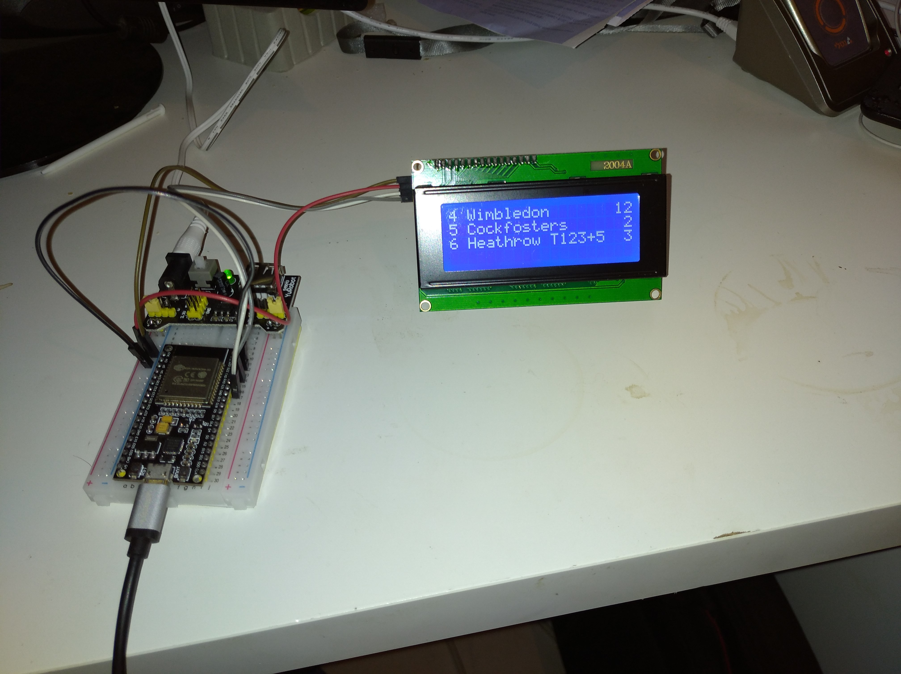
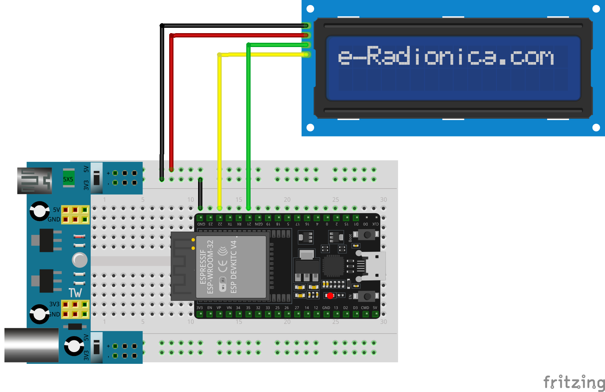

[Watch the video](https://youtu.be/iu9-asFMyhk)
# Introduction
This projects retrieves publically available data from [Transport For London](https://api-portal.tfl.gov.uk/apis), parses the relevant data and displays it on a 2004 LCD screen.  
While my initial attempt was achieved quickly I soon realised that the correct approach would be to develop a generic application controlled by a configuration file. And this, I hope, is whats I have achieved.  
No data is hard wired into the code, no wifi credentials, station ID's, screen sizes etc. All is contained in a JSON file stored externally to the code.  
My solution was developed on an ESP32 development board. These are widely available, provide WiFi connectivity, ample RAM and flash memory and cheap. It should be feasible to repeat this project on a similar board like Raspberry Pi Zero W or Pico W.  
My screen is an 2004 LCD via an I2C interface. Porting to another screen should be easy as my code is compartmentalized. All screen activity is contained within a single source file
## Architecture
### main.cpp
Initialises the system and periodically accesses TFL to retrieve fresh data.
### wifi.cpp
Manages the WiFi connection to an access point. The configuration file may contain a number of WiFi SSID/password pairs of credentials and the code will pick that one suitable for the local access point.
### jSonHandler.cpp
The configuration file <b>config.json</b> is read into memory. Part of the configuration contains an array of keys used to filter the incoming data from TFL. By filtering the data we greatly reduce the memory requirements of the application.  
Incoming data from TFL is read, filtered and the resulting JSON object processed prior to display.
### Item class
This class encapsulates the essential data of 1 arrival at a platform, its Platform number, Destination name, towards field and Time To Arrival.
### Process.cpp
The incoming data has 4 characteristics of interest, Destination, towards Time of Arrival (expressed in seconds) and Platform Number.  
Becauses of the limitations of the display device one has to select which data that can be shown. The 2004 LCD can only show 4 lines. For a small station e.g. Acton Main Line with only 2 platforms that means we can show 2 arrivals per platform. A busier station e.g. Earls Court has 6 platforms so we have to choose a maximum of 4. That also limits us to 1 arrival per platform.  
JSON does not lend itself to sorting so my solution is to make and array of *List*. Each list contains instances of the *Item* class. Each list is sorted by *TimeToStation* and fed to the, final, display stage.
### Display.cpp
Display takes the top number of items in the list and sends them to the display device.  
Some compromises are in order. A line of 20 characters formatted as Platform Number, Destination and Arrival Time (in minutes) only has 15 characters to show the Destination. Many destinations in the incoming data are much more verbose e.g. on the Elizabeth Line Heathrow Terminal 4 is shown as <b>Heathrow Terminal 4 Underground Station</b>. By using a substition table I replace that with <b>Heathrow T4</b>
## TFL API
The URL for getting a wodge of data (in JSON format) is https://api.tfl.gov.uk/StopPoint/910GACTONML/Arrivals where *910GACTONML* is the Station ID for Acton Town Main Line.  
To find the station ID for your station do a search https://api.tfl.gov.uk/StopPoint/Search/????? where *?????* is the name (or partial name) of what you are looking for. Note the search is case insensitive.  
Scan the returned JSON file for the ID you need.
## Configuration
The configuration file *config.json* is comprised of the following sections
### WiFi
A list of key:value pairs where *key* is a known SSID and *value* the password to coonect to that SSID
### stations
An array of station objects, each characterised by the following key:value pairs.
- Name   Not actually used yet, string
- ID The ID of an TFL StopPoint, type 'tube' e.g. *910GACTONML* for Acton Main Line.
- PlatformsToDisplay An integer array of which platformS to display from the arrival data.
- rowsPerPlatform How many rows of data per platform to be displayed.  The size of the *PlatformsToDisplay* array times *rowsPerPlatform* should not exceed the number of rows on the display device.
### defaultStation
The index of *stations* to be displayed.   
### filterKeys
A list of keys for filtering incoming Arrivals data. You should familiarise yourself with the JSON structure of TFL API to understand this.  
Note that the Arrivals JSON data has 2 fields showing the destination name, *destinationName* and *towards*.  
While *destinationName* always appears *towards* may or may not. If present I prefer to use *towards* as it gives a more accurate picture. For example the Picadilly Line to Heathrow shows *"destinationName":"Heathrow Terminal 2 & 3"* and *"towards":"Heathrow T123 + 5"* for the same train.
### server
The web address for TFL API.
### URL
The format for combining the server address and station ID for retrieving data for a particular station.
### refreshDelaySeconds
How often to request new data from TFL. Note that an occasional user does not need to request permission from TFL for access. A commercial user (> 500 request per minutes) needs to get an application key.
### substitutes
As mentioned before many destination names are too long to fit on the display. *substitutes* is an array of key:value pairs where *key* is the long destination name as seen in incoming data and *value* is a short name that conveys the same information and fits the available space. You may add new key:value pairs as necessary. Note this will affect the size of memory to be allocated for the config JSON object.
## Compilation
This is a Visual Studio, Platform IO project where compilation options are contained in the *platformio.ini* file, section *build_flags*.  
- CONFIG_SIZE=nnn FILTER_SIZE=nnn DOC_SIZE=nnn. These affect memory allocated for JSON objects config,filter and doc. The default values here should suffice. The only time you probably need to make a change is for DOC. My default value of 3000 is sufficient for busy Baker Street with its many platforms but there may be a station out there that needs more. To make an estimate get a block of JSON from a station and visit [here](https://arduinojson.org/v6/assistant/#/step1). This will give an indications of the space needed for unfiltered data. In my experience filtering reduces that by a factor of 8.
- ARDUINOJSON_ENABLE_COMMENTS The JSON standard does not allow embedded comments. ArduinoJSON handles embedded comments if this macro is defined.
- DEBUG Turn on general debugging data. Hopefully not needed.
- LOGRAW Print all incoming data to Serial.
## LCD Display
### Wiring

Many online tutorials show an LCD being powered from the 5V pin of an ESP32. Note this will <b>NOT</b> work as an ESP32 cannot supply enough power. My setup uses a breadboard power supply powered by an external power source. I2C connections are direct from ESP32 to LCD/I2C without 3.3V to 5V conversion.
## Issues 
- Refreshing data, if data is missing should I age previous data?  is that legitimate as is it no longer TFL data? 
- Platform numbers are expressed as verbose text e.g "Eastbound Platform 6". In extracting the number I skip all non-digits until arriving at the first digit and converting from there. So far this has worked without problems.  
- Time To Arrival is expressed in seconds, I convert this to minutes and round down.
## ToDo
### Rotary Encoder
Choose station dynamically
### Smoother display update
Do not clear screen, just update where changed
